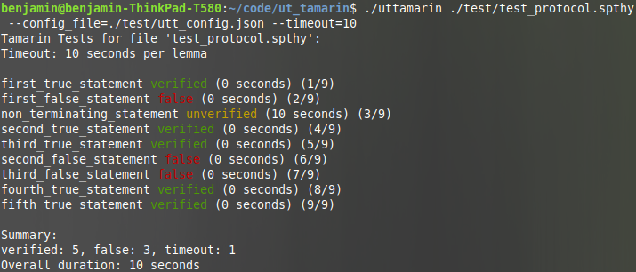

# UT Tamarin

UT Tamarin is a simple tool that assists you with the development and maintenance of models for the automated-reasoning tool [Tamarin](https://tamarin-prover.github.io), which is used for verifying security protocols. In case you are working with big Tamarin models that contain lots of lemmas, UT Tamarin might be exactly what you were looking for. The main features are as follows:

* Run Tamarin on a list of lemmas with a specified timeout and print the results.
* Specify dedicated heuristics that are tailored to specific lemmas.
* Run Tamarin on a lemma by trying all predefined heuristics ("hammer" at the lemma).

Lemma lists and dedicated heuristics can be specified in a JSON config file as explained below. The following screenshot shows a typical output of UT Tamarin when run on a couple of lemmas:

## Getting Started

### Prerequisites

UT Tamarin requires an installed version of Tamarin. By default, UT Tamarin assumes that Tamarin is in your PATH, meaning that it can be executed by calling `tamarin-prover`. If this is not the case, then you can specify the path to an executable of Tamarin.

### Installation

To build UT Tamarin, just run the `make` command from within the main directory. This then builds the executable `ut_tamarin`.

### Running UT Tamarin

To run UT Tamarin, just execute the following command from the shell: 

`./ut_tamarin INPUT_TAMARIN_FILE --config_file=CONFIG_FILE`

* `INPUT_TAMARIN_FILE` is the path to a Tamarin theory file (i.e., a .spthy file)
* `CONFIG_FILE` is the path to a JSON file that contains configuration options for UT Tamarin such as the list of lemmas that should be proved or dedicated custom heuristics. See below for details.

For example, if your Tamarin theory file is the file test_protocol.spthy (located in the directory from which you call UT Tamarin) and your JSON config file is the file utt_config.json, then you would call UT Tamarin as follows:

`./ut_tamarin test_protocol.spthy --config_file=utt_config.json`

Further arguments, such as a dedicated timeout for Tamarin (default is ten minutes) can be passed to UT Tamarin. For details call `./ut_tamarin --help`.

Finally, make sure you have write access to the directory from which you call ut_tamarin because ut_tamarin produces temporary files in that directory.

### Specifying Configurations Options of UT Tamarin

